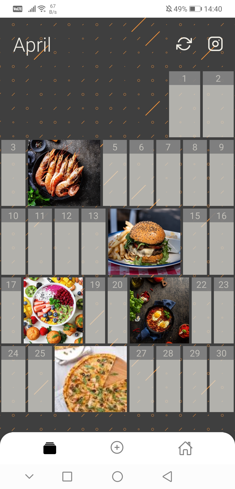
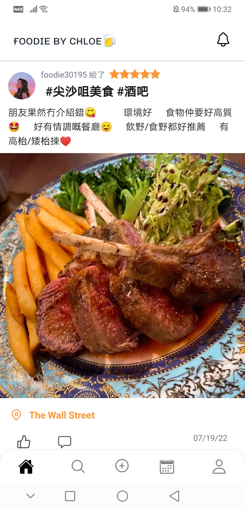
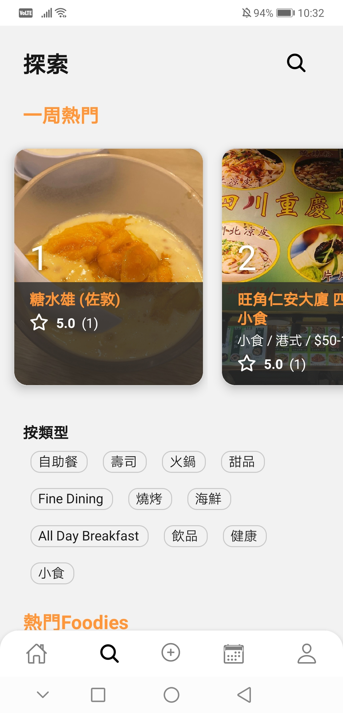
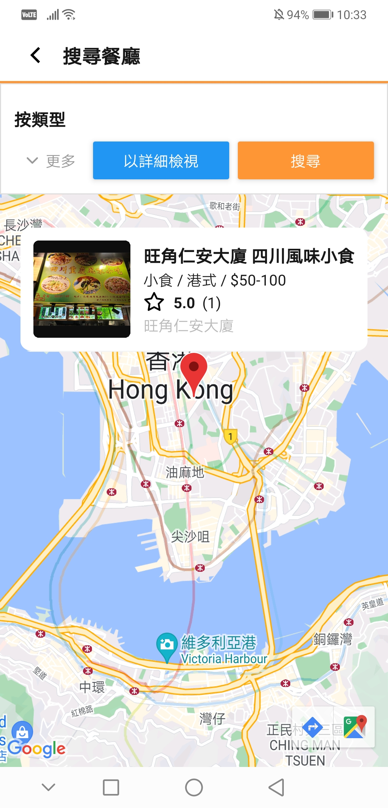

#  FoodieByChloe 

A mobile food review platform for Hong Kong (iOS/Android)

  
  
  

## Features
- Follow friends and foodies
- Record meals with image filters
- Explore and rate restaurants
- Export to Instagram story
- Like and comment to posts

The foodieScore system is now available where you can see the foodie journey with your friends

## Links
<a href='https://apps.apple.com/us/app/foodiebychloe/id1641305949'>App Store</a>
 
<a href='https://play.google.com/store/apps/details?id=com.foodiebychloe'>Google Play</a>
 
<a href='https://www.instagram.com/foodiebychloe/'>Instagram</a>
